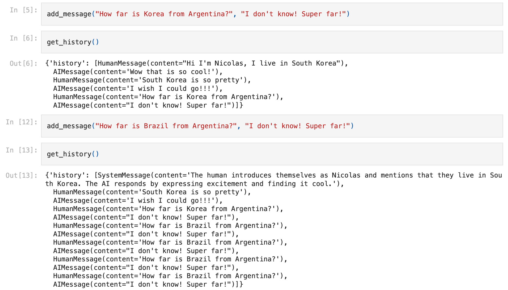

# Lecture 4~5

## 4. MODEL IO
- Langchain에는 많은 모듈이 있음

    1) Model I/O : 모델의 입출력 관리모듈, 전세계 언어관련 모델과 상호작용할 수 있는 블록 방식 기능 제공. Prompt(명령을 내리는 곳)임. 언어모델, LMS 또는 채팅모델, output parsers 등이 있음
    2) retrieval : 외부데이터로 접근하여 이를 모델에 어떻게 제공하는지에 관한 것.
        - Document loaders
        - Transformers
        - Text embedding
        - Vector stores
        - retrievers 

    3) Chains : LLM 관련도구, 전처리 등 기능 제공 (LCEL 활용)
    4) Agents : 독립적으로 AI가 작동하도록 만들수 있게 해줌. Chain이 필요한 도구들을 선택하여 사용할 수 있도록 함. 그냥 일을 Chain에 시키고 그에 맞는 커스텀 도구를 만들어주면 Chain 스스로 사용할 tool들을 선택함 (실험적인 단계)
    5) Memory : 챗봇에 memory를 추가함 
    6) Callback : 기본적으로 model이 무엇을 하고 있는지 중간에 알 수 있도록 함. 


## 4.1 FewShotPromptTemplate
- 구체적으로 대답하는 AI 모델이 필요할 때, 모델에게 어떻게 대답해야하는 지에 대한 예제를 AI모델에게 주는 방법이 Prompt를 사용해서 어떻게 대답해야하는지 알려주는 것보다 좋음.
- 예를 들어, 고객지원 봇을 만든다 했을 때 대화기록들을 FewShotPromptTemplate를 사용해서 형식화해서 주면 더 빠르게 잘 만들 수 있음.
- FewShotPromptTemplate내에서 유효성검사도 가능 

```python
from langchain.chat_models import ChatOpenAI
from langchain.prompts import PromptTemplate
from langchain.prompts.few_shot import FewShotPromptTemplate
from langchain.callbacks import StreamingStdOutCallbackHandler

chat = ChatOpenAI(
    model_name='gpt-4o-mini', 
    temperature=0.1, 
    streaming=True, 
    callbacks=[
        StreamingStdOutCallbackHandler()
    ],
)

examples = [
    {
        "question": "What do you know about France?",
        "answer": """
        Here is what I know:
        Capital: Paris
        Language: French
        Food: Wine and Cheese
        Currency: Euro
        """,
    },
    {
        "question": "What do you know about Italy?",
        "answer": """
        I know this:
        Capital: Rome
        Language: Italian
        Food: Pizza and Pasta
        Currency: Euro
        """,
    },
    {
        "question": "What do you know about Greece?",
        "answer": """
        I know this:
        Capital: Athens
        Language: Greek
        Food: Souvlaki and Feta Cheese
        Currency: Euro
        """,
    },
]

example_prompt = PromptTemplate.from_template("Human: {question}\nAI:{answer}")

prompt = FewShotPromptTemplate(
    example_prompt=example_prompt,
    examples=examples,
    suffix="Human: What do you know about {country}?",
    input_variables=["country"],
)

chain = prompt | chat

prompt.format(country="Germany")
```

```
prompt : 

'Human: What do you know about France?\nAI:\n        Here is what I know:\n        Capital: Paris\n        Language: French\n        Food: Wine and Cheese\n        Currency: Euro\n        \n\nHuman: What do you know about Italy?\nAI:\n        I know this:\n        Capital: Rome\n        Language: Italian\n        Food: Pizza and Pasta\n        Currency: Euro\n        \n\nHuman: What do you know about Greece?\nAI:\n        I know this:\n        Capital: Athens\n        Language: Greek\n        Food: Souvlaki and Feta Cheese\n        Currency: Euro\n        \n\nHuman: What do you know about Germany?'
```

```
AI 결과 : 

AI: I know this about Turkey:
- Capital: Ankara
- Language: Turkish
- Food: Kebab and Baklava
- Currency: Turkish Lira
```

## 4.2 FewShotChatMessagePromptTemplate
- 기존 FewShotPromptTemplate보다 직관적임
- 이 기능을 통해 시스템 메시지/예제/질문이 포함된 나만의 최종 프롬프트를 가질 수 있음 


```python
examples = [
    {
        "country": "France",
        "answer": """
        Here is what I know:
        Capital: Paris
        Language: French
        Food: Wine and Cheese
        Currency: Euro
        """,
    },
    {
        "country": "Italy",
        "answer": """
        I know this:
        Capital: Rome
        Language: Italian
        Food: Pizza and Pasta
        Currency: Euro
        """,
    },
    {
        "country": "Greece",
        "answer": """
        I know this:
        Capital: Athens
        Language: Greek
        Food: Souvlaki and Feta Cheese
        Currency: Euro
        """,
    },
]

example_prompt = ChatPromptTemplate.from_messages([
    ("human", "What do you know about {country}?"),
    ("ai", "{answer}")
])

example_prompt = FewShotChatMessagePromptTemplate(
    example_prompt=example_prompt,
    examples=examples,
)

final_prompt = ChatPromptTemplate.from_messages(
    [
        ("system", "You are a geography export, you give short answer"),
        example_prompt,
        ("human","What do you know about {country}?"),
    ]
)

chain = final_prompt | chat

chain.invoke({"country": "Germany"})
```

## 4.3 LengthBasedExampleSelector
- 프롬프트에 많은 비용을 지불하지 않게하려면 적절한 예제들을 선택해야함
- 많은 비용을 지불할 수 있다 하더라도 모델마다 알맞는 양이 있기 때문에 적절한 것을 선택해야 함 
- LengthBasedExampleSelector는 Dynamic하게 예제들을 선택할 수 있는 기능이며, 기본적으로 예제들을 형식화 할 수 있고 예제의 양이 얼마나 되는지 확인 가능 
- 그럼 본인이 설정한 세팅값에 따라 알맞는 Prompt 예제를 골라줌
- max_length를 통해 예제의 양 조절 가능 
- BaseExampleSelector를 이용하여 example을 랜덤하게 해줄 수 있음 

```python
from langchain.prompts.example_selector.base import BaseExampleSelector

class RandomExampleSelector(BaseExampleSelector):
    def __init__(self, examples):
        self.examples = examples
    
    def add_example(self, example):
        self.examples.append(example)
    
    def select_examples(self, input_variables):
        from random import choice
        
        return [choice(self.examples)]


example_prompt = PromptTemplate.from_template("Human: {question}\nAI:{answer}")

example_selector = RandomExampleSelector(
    examples = examples,
)

prompt = FewShotPromptTemplate(
    example_prompt=example_prompt,
    example_selector=example_selector,
    suffix="Human: What do you know about {country}?",
    input_variables=["country"],
)

# chain = prompt | chat
# chain.invoke({"country": "Turkey"})

prompt.format(country="Brazil")
```

## 4.4 Serialization and Composition
- serialize(직렬화)는 불러오기/저장을 뜻함 
- compose : 다양한 작은 Prompt template들을 결합한 것 
- 프롬프트들을 특정 공간에 저장하고 누구나 사용할 수 있게 해줌 

> yaml 형태 <br>


> json 형태 <br> 


```python
# seriallization 예제
from langchain.prompts import load_prompt

# prompt = load_prompt("./prompt.json")
prompt = load_prompt("./prompt.yaml")

prompt.format(country="Germany")
```

```python 
# Composition 예제 

from langchain.chat_models import ChatOpenAI
from langchain.callbacks import StreamingStdOutCallbackHandler
from langchain.prompts.pipeline import PipelinePromptTemplate

chat = ChatOpenAI(
    model_name='gpt-4o-mini', 
    temperature=0.1, 
    streaming=True, 
    callbacks=[
        StreamingStdOutCallbackHandler()
    ],
)

# 롤플레잉 도우미이고 캐릭터를 흉내내는 AI
intro = PromptTemplate.from_template(
    """
    You are a role playing assistant.
    And you are impersonating a {character}
"""
)

# 캐릭터들이 어떻게 질문하고 답하는지에 대한 형태 
example = PromptTemplate.from_template(
    """
    This is an example of how you talk:

    Human: {example_question}
    You: {example_answer}
"""
)

# AI도우미가 우리의 텍스트를 완성해주는 start 예제 
start = PromptTemplate.from_template(
    """
    Start now!

    Human: {question}
    You:
"""
)

# 이 모든것을 하나로 합친 프롬프트 
final = PromptTemplate.from_template(
    """
    {intro}
                                     
    {example}
                              
    {start}
"""
)

prompts = [
    ("intro", intro),
    ("example", example),
    ("start", start),
]


full_prompt = PipelinePromptTemplate(
    final_prompt=final,
    pipeline_prompts=prompts,
)


chain = full_prompt | chat

chain.invoke(
    {
        "character": "Pirate",
        "example_question": "What is your location?",
        "example_answer": "Arrrrg! That is a secret!! Arg arg!!",
        "question": "What is your fav food?",
    }
)
```

## 4.5 Caching
- LLM에서 랭체인을 작업할 수 있는 유틸리티 중 하나
- 캐싱을 사용하면 LM(언어모델)의 응답을 저장할 수 있음 
- ex) 채팅봇이 있고 채팅봇이 매번 똑같은 질문을 받는다면 계속 요청할 필요없이 이미 답변한 답을 캐싱을 이용하여 저장 및 재사용할 수 있음 (비용감소)
- SQLLite부터, GPTCache, Redis, Momento 등 다른 종류의 캐싱방법을 사용하거나 직접 개발 가능 

```python
from langchain.chat_models import ChatOpenAI
from langchain.callbacks import StreamlitCallbackHandler
from langchain.globals import set_llm_cache, set_debug
from langchain.cache import InMemoryCache

# 모든 response가 메모리에 저장됨 
set_llm_cache(InMemoryCache())

# 무슨일을 하고 있는지 보여줌.
# 추후 체인작업을 수행할때 도움이 됨 
set_debug(True)

chat = ChatOpenAI(
    temperature=0.1,
)

chat.predict("how do you make italian pasta")
```

```
set_debug(True)에 대한 결과 : 


[llm/start] [1:llm:ChatOpenAI] Entering LLM run with input:
{
  "prompts": [
    "Human: how do you make italian pasta"
  ]
}
[llm/end] [1:llm:ChatOpenAI] [3.91s] Exiting LLM run with output:
{
  "generations": [
    [
      {
        "text": "To make Italian pasta, you will need the following ingredients:\n\n- 2 cups of all-purpose flour\n- 2 large eggs\n- 1/2 teaspoon of salt\n- Water (if needed)\n\nHere is a step-by-step guide on how to make Italian pasta:\n\n1. On a clean work surface, pour the flour and make a well in the center.\n2. Crack the eggs into the well and add the salt.\n3. Using a fork, gradually mix the eggs into the flour until a dough starts to form.\n4. Use your hands to knead the dough until it becomes smooth and elastic. If the dough is too dry, add a little water. If it is too wet, add a little more flour.\n5. Once the dough is ready, cover it with a damp cloth and let it rest for about 30 minutes.\n6. After resting, divide the dough into smaller portions and roll each portion out into a thin sheet using a rolling pin or pasta machine.\n7. Cut the dough into your desired shape, such as fettuccine, spaghetti, or ravioli.\n8. Cook the pasta in a large pot of boiling salted water for a few minutes until al dente.\n9. Drain the pasta and toss it with your favorite sauce or toppings.\n\nEnjoy your homemade Italian pasta!",
        "generation_info": {
          "finish_reason": "stop"
        },
        "type": "ChatGeneration",
        "message": {
          "lc": 1,
          "type": "constructor",
          "id": [
            "langchain",
            "schema",
            "messages",
            "AIMessage"
          ],
...
    "system_fingerprint": null
  },
  "run": null
}
Output is truncated. View as a scrollable element or open in a text editor. Adjust cell output settings...
```

- SQLLite를 이용한 방법 ("cache.db"라는 파일이 생성됨)
```python
from langchain.cache import InMemoryCache, SQLiteCache

# 모든 response가 메모리에 저장됨 
set_llm_cache(SQLiteCache("cache.db"))
```

## 4.6 Serialization 
- OpenAI의 모델을 사용할 때 우리가 지출하는 비용이 얼마인지 "get_openai_callback"을 이용해서 확인 가능 

```python
# with get_openai_callback() as usage:
#   ~~~~~~ <- 이 사이에 들어가는 코드들에 대한 비용을 알 수 있음 
#      print(usage)

from langchain.chat_models import ChatOpenAI
from langchain.callbacks import get_openai_callback

chat = ChatOpenAI(
    temperature=0.1,
)

with get_openai_callback() as usage:
    chat.predict("What is the recipe for soju")
    print(usage)
```


- 모델을 어떻게 저장하고 불러오는 방법

```python
# Serialization (저장)
from langchain.chat_models import ChatOpenAI
from langchain.llms.openai import OpenAI

chat = OpenAI(
    model='gpt-4o-mini', 
    temperature=0.1,
    max_tokens=450
)

chat.save("model.json")


# Serialization (불러오기)
from langchain.chat_models import ChatOpenAI
from langchain.llms.openai import OpenAI
from langchain.llms.loading import load_llm

chat = load_llm("model.json")

chat
```


## 5. Memory
- 랭체인에는 5가지 종류의 메모리가 있는데, 각자 저장방식도 다르고 각자만의 장단점이 있음
- 챗봇에 메모리를 추가해야지만 이전 질문에 대해 기억할 수 있음
- OpenAI에서 제공하는 기본 API는 랭체인 없이 사용할 수 있는데 메모리를 지원하지 않음 (stateless)
- ChatGPT에는 메모리가 있어 실제로 사람과 대화하는 느낌을 받음 
- 모든 메모리에는 save_context, load_memory_variables라는 함수를 갖고 있음 

## 5.0 ConversationBufferMemory 
- 단순함
- 이전 대화 내용을 저장하는 메모리
- 단점은 대화 내용이 길어질수록 메모리도 커지므로 비 효율적
- LLM은 다음 질문을 할 때 이전 대답의 모든 내용을 다음 질문에 보내줘야 모델이 전에 일어났던 대화를 보고 이해할 수 있음 


## 5.1 ConversationBufferWindowMemory
- 대화의 특정부분만 저장 (개수 선택가능)
- 예를 들어, 5개만 저장한다면 여섯번째 저장 시 제일 먼저 저장된 첫번째는 버리게 됨 
- 메모리를 특정 크기로 유지시킬 수 있다는게 장점
- 단점은 최근 대화에만 집중함 (예전 대화를 기억하기 어려움)
- 예시처럼 4개 이상인 경우 가장 처음 대화 내용이 삭제됨 


## 5.2 ConversationSummaryMemory
- ConversationSummaryMemory는 메시지를 메모리에 그대로 저장하는 것이 아닌 내용을 요약하여 저장함 (특히, 매우 긴 대화에 대해 효과적임)
- LLM으로 요약하기 떄문에 비용발생됨
- 초반에는 많은 내용을 저장할 수 있으므로 비용이 많이 들지만 점점 지날 수록 효율적으로 사용하게 됨 


## 5.3 ConversationSummaryBufferMemory
- ConversationSummaryMemory와 ConversationBufferMemory의 결합형태
- 메모리에 보내온 메시지의 수를 저장함
- Limit에 다다랐을 경우 무슨일이 일어났는지 잊어버리는 대신 오래된 메시지들을 요약(summary)함

```python
from langchain.memory import ConversationSummaryBufferMemory
from langchain.chat_models import ChatOpenAI

llm = ChatOpenAI(
    temperature=0.1,    
    model_name='gpt-4o-mini', 
)

memory = ConversationSummaryBufferMemory(
    llm=llm,
    max_token_limit=80,
    return_messages=True,
)

def add_message(input, output):
    memory.save_context({"input":input},{"output":output})

def get_history():
    return memory.load_memory_variables({})

add_message("Hi I'm Hwang, I live in South Korea", "Wow that is so cool!")
```



## 5.4 ConversationKGMemory
- LLM을 사용하는 Memory Class
- 대화 내에서 엔티티(가장 중요한 내용)를 뽑아내서 저장함

```python
from langchain.memory import ConversationKGMemory
from langchain.chat_models import ChatOpenAI

llm = ChatOpenAI(
    temperature=0.1,    
    model_name='gpt-4o-mini', 
)

memory = ConversationKGMemory(
    llm=llm,
    return_messages=True,
)

def add_message(input, output):
    memory.save_context({"input":input},{"output":output})

def get_history():
    return memory.load_memory_variables({})

add_message("Hi I'm Hwang, I live in South Korea", "Wow that is so cool!")
memory.load_memory_variables({"input":"who is Hwang"})

add_message("Hwang likes kimchi!", "Wow that is so cool!")
memory.load_memory_variables({"input":"what does Hwang like"})
```


## 5.5 Memory on LLMChain
- memory를 chain에 꽂을 수 있는 방법에 대해 설명
    1. LLM Chain : Off-the-shelf chain (일반적인 목적을 가진 Chain을 의미. 랭체인에 많음)
    2. 그 외 : 개인이 커스터마이징한 체인 (LCEL 등)
- 결국, 템플릿 안에 메모리를 넣을 공간만 마련하면 됨. (아래 chat_history 처럼)
```python
memory = ConversationSummaryBufferMemory(
    llm=llm,
    max_token_limit=120,
    memory_key="chat_history"   # 이거 추가로 memory.load_memory_variables({}) 할 필요 없음 
)

template = """
    You are a helpful AI talking to a human.
    
    {chat_history}
    Human:{question}
    You: 
"""

```

## 5.6 Chat Based Memory
- Memory클래스가 2가지 형태의 Memory로


## 5.7 LCEL Based Memory
- 수동으로 만들어진 prompt를 LCEL로 표현 (커스텀)
- load_memory_variables : 메모리를 로드
- save_context : 사람과 AI 메시지인 input과 output을 메모리에 저장하는 것 


## 5.8 Recap
- LLM이 가져오는 프롬프트에 기록들을 넣는건 "개발자"의 몫임 (자동이 아님)
- 랭체인은 off-the-shelf가 있는데 이것은 자동으로 LLM으로부터 응답값을 가져오고 메모리를 업데이트 해줌
- 그럼에도 불구하고, 개발자는 메모리의 기록들을 프롬프트에 넣어줘야했었음 (Off-the-shelf LLM Chain)
- LCEL을 통해 자동으로 할 수 있는 법을 알게 됨
- 모든 설정들이 노출되어있어 커스텀하기 편함 
- RunnablePassthrough를 통해 원하는 만큼의 함수를 호출할 수 있음. 그리고 Langchain에게 이 함수의 결과와 유저가 프롬프트에 입력한 값을 달라고 하는 것임.
- langchain은 Load_memory를 실행시키고 그걸 History 속성값에 넣어준 후에 그 값을 프롬프트에 넣어주고, 유저에게 받아온 퀘스천도 값도 프롬프트에 넣어주는 것임 