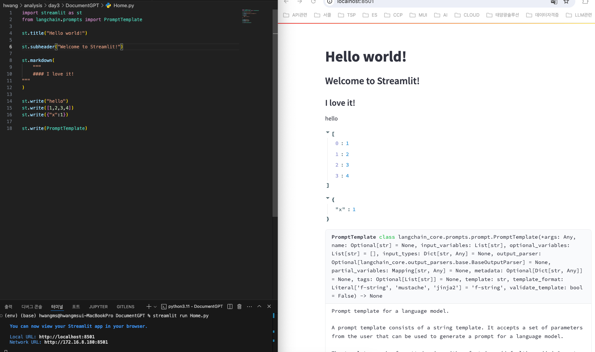

# Lecture 7. DocumentGPT

## 7.0 Introduction
- Streamlit의 실행방법과 간단한 사용법 강의
- 기본 포트는 8501로 동작 
- title, subheader, markdown 등 여러 widget들이 있음 

## 7.1 Magic
- write() : 괄호안에 무엇이 들어가든 UI상으로 표현해줌. (string, 배열, 딕셔너리, class정보 등)

- write()를 사용하지 않고도 출력 가능. (그래서 magic이라고도 함)

- streamlit은 다양한 API가 존재함. caption, code block, canvas, metrics, json, chart 등등

## 7.2 Data Flow 
- Streamlit은 다른 웹 프레임워크 (react 등)와 다르게 변경된 곳만 갱신되지 않고 전체가 갱신됨 
- text_input의 경우 입력동안은 갱신되지 않고 엔터를 쳐야 갱신됨 
- 갱신된다는 말은 새로고침이 아닌 페이지가 새롭게 실행된다는 뜻

## 7.3 Multi Page
- with block안에 들어가는 Widget들은 그 안에서만 구성됨 
```python
with st.sidebar:
    #원래는 st.sidebar.xxx로 해야함 
    st.title("sidebar title")
    st.text_input("xxx")
```
- pages 디렉토리를 생성하고 그 안에 페이지를 추가하면 UI 좌측에 페이지별로 생김
- 순서를 보장하고 싶다면 파일명 앞에 넘버링을 하자. (01_A.py, 02_B.py, 03_C.py ...)


## 7.4 Chat Messages
- 사용자가 입력한 것을 계속 저장해야하는데 기본적으로 streamlit은 코드를 처음부터 실행하므로 전역 변수로 배열을 생성하더라도 초기화때문에 매번 빈 배열로 실행될 것임
- 이를 해결하기 위해선 Session state를 사용하면 됨 

```python
import time
import streamlit as st

st.title("Document GPT")

if "messages" not in st.session_state:
    st.session_state["messages"] = []


def send_message(message, role, save=True):
    with st.chat_message(role):
        st.write(message)
    if save:
        st.session_state["messages"].append({"message": message, "role": role})


for message in st.session_state["messages"]:
    send_message(
        message["message"],
        message["role"],
        save=False,
    )


message = st.chat_input("Send a message to the ai")

if message:
    send_message(message, "human")
    time.sleep(1)
    send_message(f"You said: {message}", "ai")

    with st.sidebar:
        st.write(st.session_state)
```

