# Lecture 6. RAG (Retrieval Augmented Generation)

## 6.0 Introduction
- 기존에 학습된 수많은 데이터로 얻을 수 있는 결과보다 더 나은 답변을 할 수 있도록 도와주는 기법 
- 개인으로부터 제공된 데이터를 사용하거나 탐색함으로써 LM의 능력을 더 확장할 수 있음 
- 기 학습된 데이터를 제외한 개인자료로만으로 답변가능 (ex. 개인자료가 더 최신일 수도 있음)
- 데이터를 Retrieve하는 과정
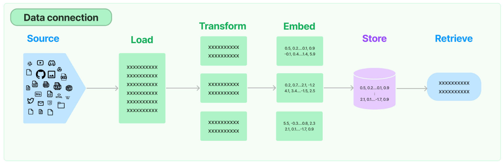

- 얼마나 많은 문서를 갖고 있는지, 얼마만큼의 비용으로 운영할지, 어떤 모델을 사용할지, 얼마나 많은 토큰을 사용할지에 따라 방식들을 선택하면 됨 

> 1. Stuff 방식
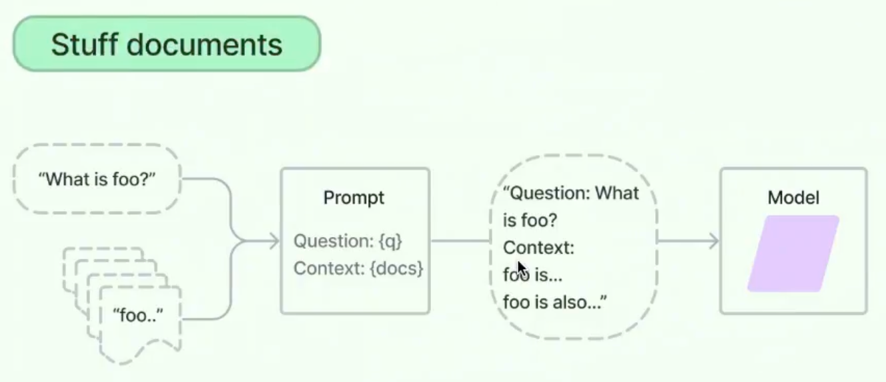

> 2. Refine 방식 
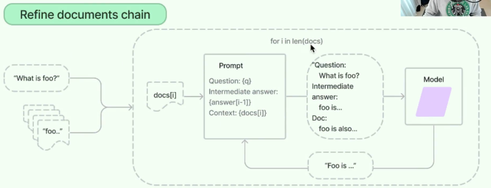

> 3. Map Reduce 방식 
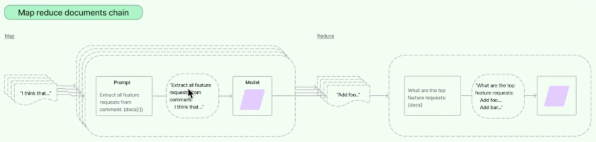


## 6.1 Data Loaders and Splitters
- Retrival 랭체인의 모듈 
- Document Loader는 소스에서 데이터를 추출하고 랭체인에 가져다 주는 모듈 (Git, GitHub, Figma, Facebook chat, slack 등 여려군데에서 가져올 수 있음)
- 문서는 너무나 큰 덩어리이기 때문에 작은 조각들로 분할해놓는다면 원하는 결과를 찾는게 수월해짐 (응답도 빨라지며, LLM 비용도 줄일 수 있음)
- split하는데 두가지 옵션이 있음
    - RecursiveCharacterTextSplitter : 문장 끝이나 문단의 끝부분마다 끊어줌
    ```python
    # TextLoader, PyPDFLoader, ... UnstructuredFileLoader는 pdf, docx 등 여러가지 가능
    from langchain.document_loaders import UnstructuredFileLoader 
    from langchain.chat_models import ChatOpenAI
    from langchain.text_splitter import RecursiveCharacterTextSplitter

    # 문장 끝이나 문단의 끝부분마다 끊어줌.
    # chunk_size를 주면 원하는 사이즈만큼 자르긴 하지만 문장 중간을 잘라내기 때문에 좋지 않음
    # 이럴 경우, chunk_overlap을 사용하여 겹쳐서 자르도록 하면 좋음
    splitter = RecursiveCharacterTextSplitter(
        chunk_size=200,
        chunk_overlap=50,
    ) 

    loader = UnstructuredFileLoader("hwang/analysis/day3/iDERMS_VPP_Brochure_202306.pdf")

    loader.load_and_split(text_splitter=splitter)
    ```
    - CharacterTextSplitter : 특정 문자열을 찾아 끊음 (Ex. ---와 같은 분절선, \n 등)
    ```python
    # TextLoader, PyPDFLoader, ... UnstructuredFileLoader는 pdf, docx 등 여러가지 가능
    from langchain.document_loaders import UnstructuredFileLoader 
    from langchain.chat_models import ChatOpenAI
    from langchain.text_splitter import CharacterTextSplitter

    # 특정 문자로 끊음
    # 최대 글자개수가 600인 문서로 나뉨 
    splitter = CharacterTextSplitter(
        separator="\n",
        chunk_size=600, # separator가 없을 경우 좀 더 커질수도 작아질 수도 있음. 청크는 작을수록 좋음
        chunk_overlap=100,
    ) 

    loader = UnstructuredFileLoader("hwang/analysis/day3/iDERMS_VPP_Brochure_202306.pdf")

    loader.load_and_split(text_splitter=splitter)
    ```

## 6.2 Tiktoken
- 기본적으로 모든 splitter들은 텍스트의 Length를 계산하여 한 덩어리의(chunk) 크기를 알아냄 (파이썬 기본함수인 len()으로..)
- 사실 LLM에서의 token은 len()으로 글자 세는 것과 다름. (문자(letter)와 같은 의미가 아니며, 문자 2개, 3개짜리가 token 1개로 취급될 수 있음)
- https://platform.openai.com/tokenizer 에서 계산 가능 
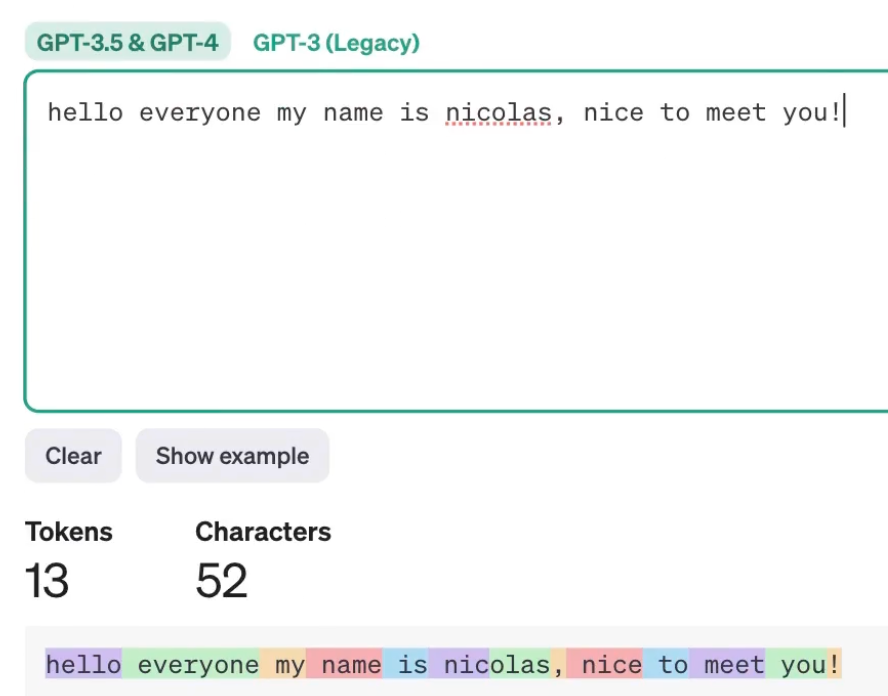

- token은 문자가 아님. (아래 이미지처럼 벡터 형태임)
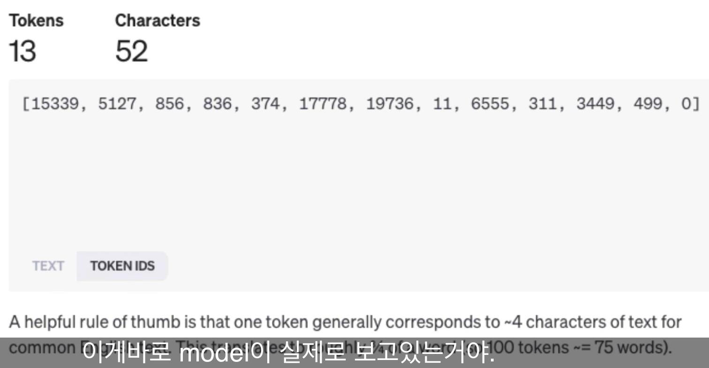


- token화는 from_tiktoken_encoder하면 됨 
```python
# 특정 문자로 끊음
# 최대 글자개수가 600인 문서로 나뉨 
splitter = CharacterTextSplitter.from_tiktoken_encoder(
    separator="\n",
    chunk_size=600, # separator가 없을 경우 좀 더 커질수도 작아질 수도 있음. 청크는 작을수록 좋음
    chunk_overlap=100,
) 

loader = UnstructuredFileLoader("hwang/analysis/day3/iDERMS_VPP_Brochure_202306.pdf")

loader.load_and_split(text_splitter=splitter)
```

## 6.3 Embedding
- Embedding : 사람이 읽는 텍스트를 컴퓨터가 이해할 수 있는 숫자들로 변환하는 작업 
- Source -> Load -> Transform -> Vectorization
- 우리가 만든 문서마다 각각의 벡터를 생성함 (OpenAI는 최소 1,000차원을 갖는 벡터를 제공함)


- Embedding에 대한 예시

||Masculinity|Feminity|Royalty|remarks|
|---------|---------|----------|-----------|-------|
king|0.9|0.1|1.0||
man|0.9|0.1|0.0||
woman|0.1|0.9|0.0|| 
royal|0.0|0.0|1.0|king - man| 
queen|0.1|0.9|1.0|royal + woman| 

- 위와 같은 예시를 통해 기존 벡터를 이용해서 비슷한 벡터를 찾을 수 있음 = 가까운 벡터 = 추천 알고리즘  
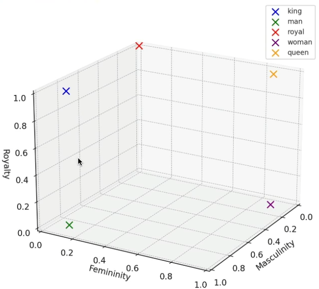

- 단어를 입력하면 비슷한 벡터를 가진 단어들을 보여주는 곳 : https://turbomaze.github.io/word2vecjson
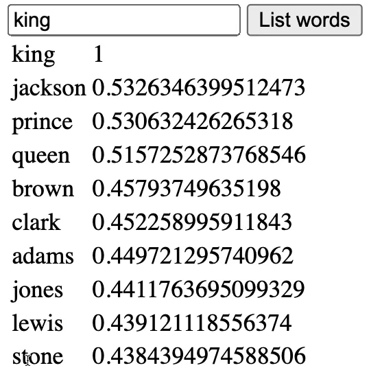
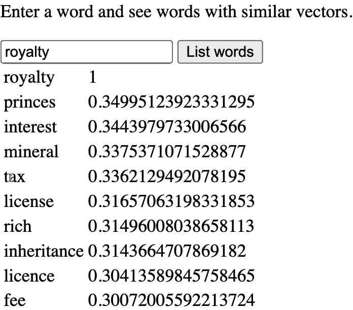
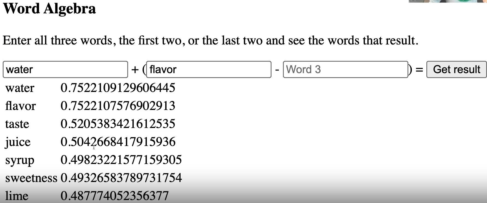
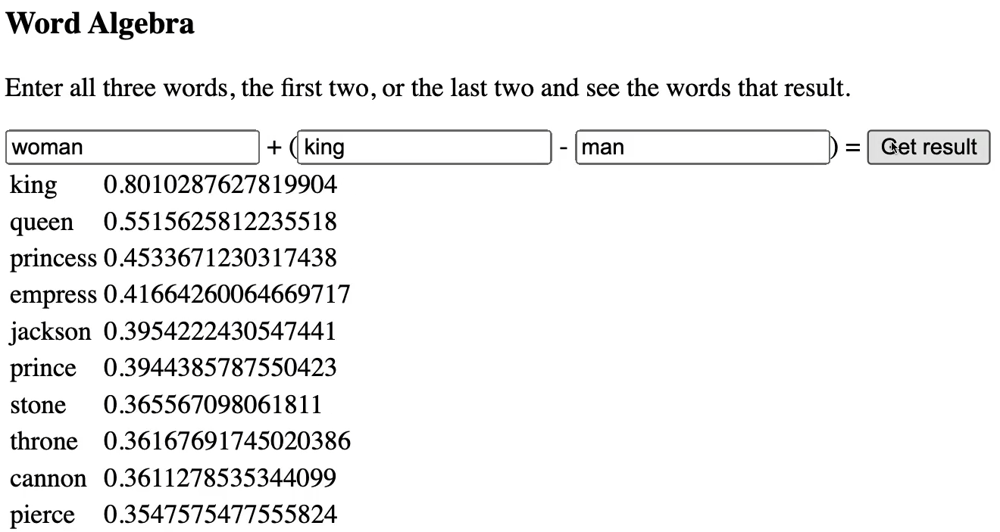


## 6.4 Vector Store
- OPEN AI에서는 Embedding할 수 있도록 API를 제공해줌
- vector에 대해 알아보면 아래와 같음 
```python
from langchain.embeddings import OpenAIEmbeddings
embedder = OpenAIEmbeddings()

vector = embedder.embed_query("Hi")
len(vector) # 1,536개

vector = embedder.embed_documents([
    "Hi",
    "How",
    "are",
    "you longer sentences because"
]) 
len(vector) # 벡터의 개수는 4개. 위 4개의 각 문서에 하나씩 할당된 것을 볼 수 있음

print(len(vector), len(vector[0])) # 4 1536  -> 벡터의 개수는 4개이며 각각 1,536차원으로 구성됨
```

- Vector Store는 일종의 데이터베이스. 이것을 활용하여 벡터들을 검색 가능 
- Langchain은 다양한 Vector Store들을 지원함 (클라우드에 있으며 유/무료 존재)
- 강의에서는 chroma를 사용함
- chroma를 생성하고, 여기에 Splitted문서와 OpenAI Embeddings Model을 전달하고자 함 

```python
# TextLoader, PyPDFLoader, ... UnstructuredFileLoader는 pdf, docx 등 여러가지 가능
from langchain.document_loaders import PyPDFLoader 
from langchain.chat_models import ChatOpenAI
from langchain.text_splitter import CharacterTextSplitter
from langchain.vectorstores import Chroma
from langchain.embeddings import OpenAIEmbeddings # text-embedding-ada-002 모델을 사용함 

# 특정 문자로 끊음
# 최대 글자개수가 600인 문서로 나뉨 
splitter = CharacterTextSplitter.from_tiktoken_encoder(
    separator="\n",
    chunk_size=600, # separator가 없을 경우 좀 더 커질수도 작아질 수도 있음. 청크는 작을수록 좋음
    chunk_overlap=100,
) 

loader = PyPDFLoader("/Users/hwangms/Documents/workspace/LLM_Study/langchain_study/hwang/analysis/day3/orwellanimalfarm.pdf")

docs = loader.load_and_split(text_splitter=splitter)

embeddings = OpenAIEmbeddings()

vectorstore = Chroma.from_documents(docs, embeddings)
```

```python
# 유사도검색
results = vectorstore.similarity_search("where does winston live")

len(results) # 4개의 문서를 리턴함
```
- 아래와 같이 vector store내에서 결과를 확인할 수 있음 
- 문서를 분할하지 않았을 경우 너무 큰 문서들이 LLM에 전달되기 때문에 비용이 많이 들 것임
- 그렇다고 너무 잘게 분할할경우 모든 문맥과 의미가 소멸될테니 성능이 더 안좋아짐 
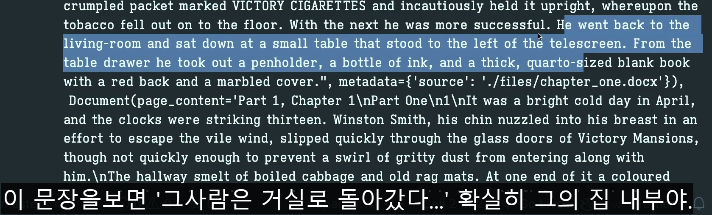
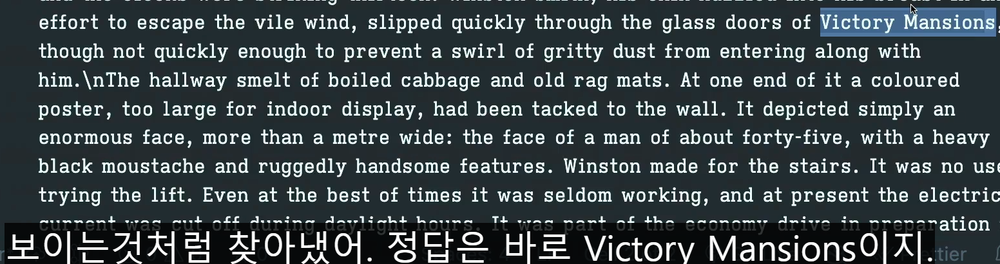

- 비용을 절약하기 위해 임베딩들을 캐싱을 통해 절약하고자 함 (처음에만 OPENAI임베딩을, 이후로는 캐싱된 임베딩)
```python
# TextLoader, PyPDFLoader, ... UnstructuredFileLoader는 pdf, docx 등 여러가지 가능
from langchain.document_loaders import PyPDFLoader 
from langchain.chat_models import ChatOpenAI
from langchain.text_splitter import CharacterTextSplitter
from langchain.vectorstores import Chroma
from langchain.embeddings import OpenAIEmbeddings, CacheBackedEmbeddings # text-embedding-ada-002 모델을 사용함 
from langchain.storage import LocalFileStore

cache_dir = LocalFileStore("./.cache/")

# 특정 문자로 끊음
# 최대 글자개수가 600인 문서로 나뉨 
splitter = CharacterTextSplitter.from_tiktoken_encoder(
    separator="\n",
    chunk_size=600, # separator가 없을 경우 좀 더 커질수도 작아질 수도 있음. 청크는 작을수록 좋음
    chunk_overlap=100,
) 

loader = PyPDFLoader("/Users/hwangms/Documents/workspace/LLM_Study/langchain_study/hwang/analysis/day3/orwellanimalfarm.pdf")

docs = loader.load_and_split(text_splitter=splitter)

embeddings = OpenAIEmbeddings()

cached_embeddings = CacheBackedEmbeddings.from_bytes_store(
    embeddings,
    cache_dir
)

vectorstore = Chroma.from_documents(docs, cached_embeddings)
```
- 캐시파일에 많은 임베딩들이 저장된 것을 확인할 수 있음
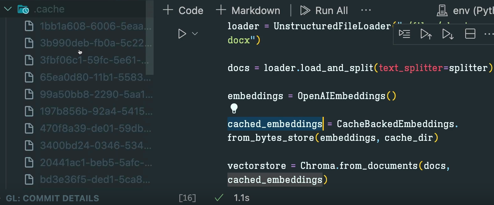


## 6.5 Langsmith 
- 구축한 Chain이 무엇을 하고 있는지 시각적으로 확인할 수 있음 

## 6.6 RetrievalQA
- off-the-shelf chain들을 이용하는 방법인데 현재는 LCEL을 권장하고 있기 때문에 Deprecated 예정으로 보임 (RetrievalQA를 이용하여 chain_type을 다양하게 변경하며 개발 가능)
- 종류 : Stuff / Refine / Map Reduce / Map Re-rank

을 먼저 살펴보고 LCEL으로 변형하고자 함 

### 6.6.1. Stuff(채우기) 방식
    - prompt에 내가 찾은 document들을 stuff하는 방법
    - 질문+질문과 관련된 문서 > 프롬프트 > 모델 (질문 + 질문과 관련된 문서 + 기 학습된 데이터)


### 6.6.2. Refine 방식 
    - 질문에 대해 각각의 document들을 읽으면서 질문에 대한 답변생성을 시도함 
    - 위 작업을 반복하면서 만나는 모든 document들을 통해 question을 개선함 (퀄리티가 점점 좋아짐)
    - 당연히 요금 비쌈 (document가 10개있다면 10번을 호출하기 때문)


### 6.6.3. Map Reduce 방식 
    - Document들을 입력받아서 개별적으로 요약작업을 수행
    - Query를 입력하면 document들을 각각 요약하고 이를 LLM에게 전달 
    - 많은 연산을 수행함


### 6.6.4. Map Re-Rank 방식 
    - 질문을 하면 관련된 document들을 받아 답변을 생성하고 각 답변에 점수를 매김
    - 최종적으로 가장 높은 점수를 획득한 답변과 그 점수를 함께 반환함 
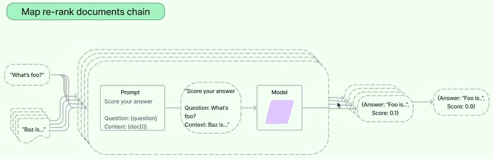

## 6.7 Recap


## 6.8 Stuff LCEL Chain

- chain의 구성요소에서 Retriever의 input은 질문이나 그와 관련성이 있는 document를 얻기 위한 query를 입력받음 그리고, output은 documents의 list
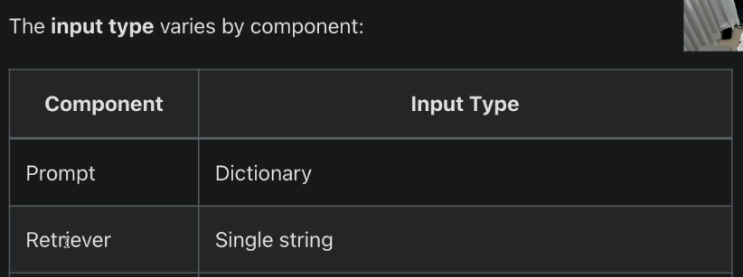
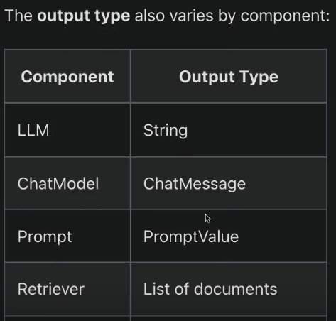


```python
from langchain.chat_models import ChatOpenAI
from langchain.document_loaders import PyPDFLoader
from langchain.text_splitter import CharacterTextSplitter
from langchain.embeddings import OpenAIEmbeddings, CacheBackedEmbeddings
from langchain.vectorstores import FAISS
from langchain.storage import LocalFileStore
from langchain.prompts import ChatPromptTemplate
from langchain.schema.runnable import RunnablePassthrough

llm = ChatOpenAI(
    temperature=0.1,
)

cache_dir = LocalFileStore("./.cache/")

splitter = CharacterTextSplitter.from_tiktoken_encoder(
    separator="\n",
    chunk_size=600,
    chunk_overlap=100,
)
loader = PyPDFLoader("/Users/hwangms/Documents/workspace/LLM_Study/langchain_study/hwang/analysis/day3/orwellanimalfarm.pdf")


docs = loader.load_and_split(text_splitter=splitter)

embeddings = OpenAIEmbeddings()

cached_embeddings = CacheBackedEmbeddings.from_bytes_store(embeddings, cache_dir)

vectorstore = FAISS.from_documents(docs, cached_embeddings)

retriver = vectorstore.as_retriever()

prompt = ChatPromptTemplate.from_messages(
    [
        (
            "system",
            "You are a helpful assistant. Answer questions using only the following context. If you don't know the answer just say you don't know, don't make it up:\n\n{context}",
        ),
        ("human", "{question}"),
    ]
)

chain = (
    {
        "context": retriver, # invoke에 넣은 input값을 넣어 문서들을 조회하고 document의 list를 반환함
        "question": RunnablePassthrough(), # invoke의 input이 들어옴
    }
    | prompt
    | llm
)

chain.invoke("Describe Victory Mansions") # retriever
```

## 6.9 Map Reduce LCEL Chain
- 원리 :
    1. 질문에 대한 document들의 list를 가져오고 (retriever)
    2. list내 각 document들을 위한 prompt를 만듬
    3. prompt는 LLM에 전달 (prompt:이 document를 읽고 사용자의 질문에 답변하기에 적절한 정보가 있는지 확인해주세요.)
    4. LLM이 response를 주면 이를 취합하여 하나의 document를 생성함 
    5. 최종적으로 만들어진 document가 LLM을 위한 prompt로 전달됨

- stuff방식과 비교하였을 때 더 효율적인건 내가 원하는 prompt의 크기와 검색할 document수에 따라 달라짐
- 만약, retriever가 검색 결과로 1,000개 이상 문서를 반환했다 하면 stuff는 사용할 수 없음. 이럴 경우 Map Reduce방식이 좋음 
- RunnableLambda는 함수 호출 

```python
from langchain.chat_models import ChatOpenAI
from langchain.document_loaders import PyPDFLoader
from langchain.text_splitter import CharacterTextSplitter
from langchain.embeddings import OpenAIEmbeddings, CacheBackedEmbeddings
from langchain.vectorstores import FAISS
from langchain.storage import LocalFileStore
from langchain.prompts import ChatPromptTemplate
from langchain.schema.runnable import RunnablePassthrough, RunnableLambda

llm = ChatOpenAI(
    temperature=0.1,
)

cache_dir = LocalFileStore("./.cache/")

splitter = CharacterTextSplitter.from_tiktoken_encoder(
    separator="\n",
    chunk_size=600,
    chunk_overlap=100,
)
loader = PyPDFLoader("/Users/hwangms/Documents/workspace/LLM_Study/langchain_study/hwang/analysis/day3/orwellanimalfarm.pdf")


docs = loader.load_and_split(text_splitter=splitter)

embeddings = OpenAIEmbeddings()

cached_embeddings = CacheBackedEmbeddings.from_bytes_store(embeddings, cache_dir)

vectorstore = FAISS.from_documents(docs, cached_embeddings)

retriever = vectorstore.as_retriever()


map_doc_prompt = ChatPromptTemplate.from_messages(
    [
        (
            "system",
            """
            Use the following portion of a long document to see if any of the text is relevant to answer the question. Return any relevant text verbatim. If there is no relevant text, return : ''
            -------
            {context}
            """,
        ),
        ("human", "{question}"),
    ]
)

map_doc_chain = map_doc_prompt | llm


def map_docs(inputs):
    documents = inputs["documents"]
    question = inputs["question"]
    return "\n\n".join(
        map_doc_chain.invoke(
            {"context": doc.page_content, "question": question}
        ).content
        for doc in documents
    )


map_chain = {
    "documents": retriever,
    "question": RunnablePassthrough(),
} | RunnableLambda(map_docs)

final_prompt = ChatPromptTemplate.from_messages(
    [
        (
            "system",
            """
            Given the following extracted parts of a long document and a question, create a final answer. 
            If you don't know the answer, just say that you don't know. Don't try to make up an answer.
            ------
            {context}
            """,
        ),
        ("human", "{question}"),
    ]
)

chain = {"context": map_chain, "question": RunnablePassthrough()} | final_prompt | llm

chain.invoke("How many ministries are mentioned")
```


## 6.10 Recap 