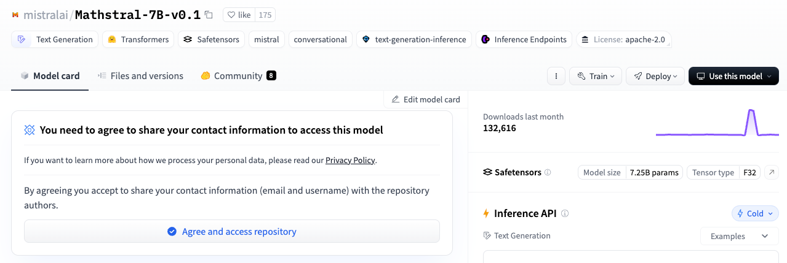
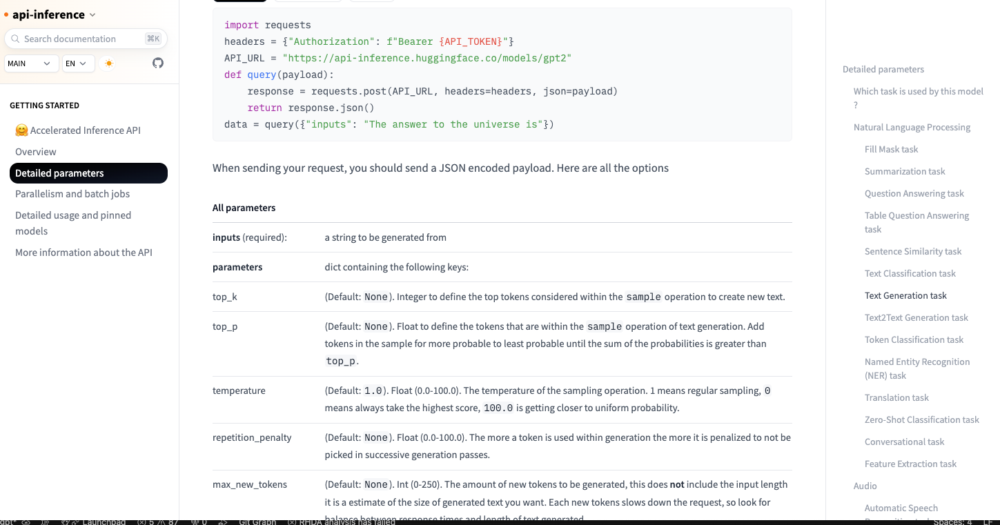
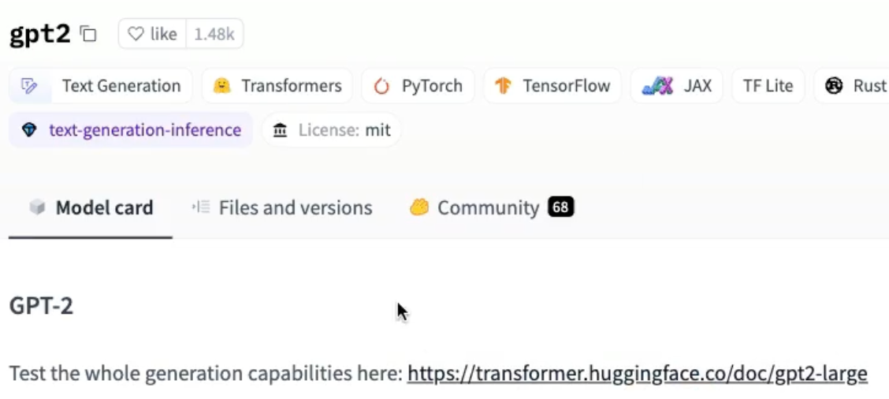
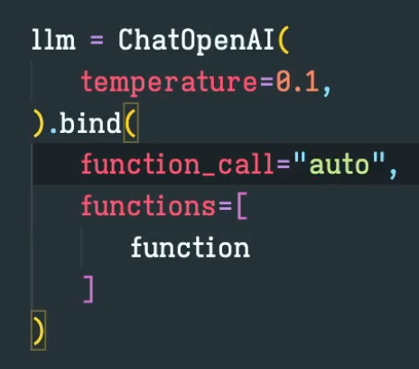
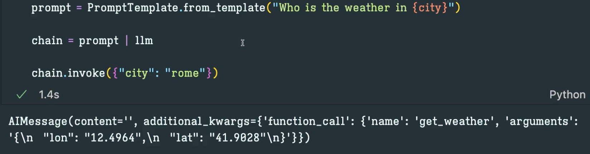
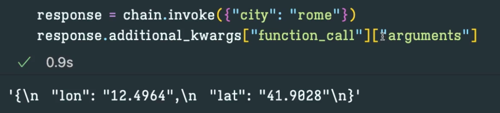

# 8 PrivateGPT
## 8.0 Introduction
## 8.1 HuggingFaceHub 
-  HuggingFace를 실행시키는 방법은 두가지임
    1. Hugging Face Inference API (Private API는 아님. 유료도 있음) : HuggingFaceHub
    2. 모델을 로컬에 내려받아 사용 : HuggingFacePipeline 

- 모델을 찾아 사용할때 해당 모델에 들어가서 API가 Inference API인지 확인 (사용가능이란 뜻)



- 모델을 추가할 때 해당 API의 도큐먼트로 가서 max token값 확인해서 넣어야함 (API-inference > Getting Started > Detailed Parameters > 화면 우측 Text Generation task > 해당 태스크의 All parameters에서 찾아야함)


- max_new_token을 최대로 설정해주지 않으면 답변이 짧음
- 모델이름 옆에 "instruct"가 붙으면 Instruction(지시)를 따르도록 세밀하게 조정되었단 뜻임
- instruct 모델 사용 시 템플릿에 [INST][/INST]를 넣으면 됨
- 데이터는 HuggingFace로 전송됨 (유의)


## 8.2 HuggingFacePipeline
- 모델 선택 후 task 를 확인해야함. gpt2의 경우 text-generation을 잘함




## 8.3 GPT4All
- GPT4All은 로컬 모델을 실행하는 또 다른 방법임 (https://www.nomic.ai/gpt4all)
- 로컬모델과 같이 사용할 수 있는 UI도 제공하고, 파인튜닝을 할 수 있는 많은 모델들도 제공함


## 8.4 Ollama
- Ollama를 설치 후 임베딩과 Chat모델을 변경
- 가지고 있는 자료를 업로드하여 테스트해보면 이상한 답변을 얻을 수 있었는데. 이는 이미 학습된 내용을 사용했기 때문임
- ChatPromptTemplate.from_messages를 from_template로 변경해야함 (template는 string만 사용)

## 8.5 Conclusions


# 9 QuizGPT

## 9.0 Introduction
- 업로드한 파일 기반으로 그 파일내용에 관한 질문을하게끔 하고자 함 (공부하는데에 도움됨)
- 위키피디아를 Retriver할 예정 
- 이 섹션의 중요 포인트는 Output Parser
- 기존에 배웠던 모델들은 어떤 형태던 모델이 원하는 방향으로 답을 함. 
- 이 섹션에서는 모델이 특정 형식으로 답을하도록 강제할 예정 (질문과 답을 생성하고 정답인지 확인할 수 있도록 결과값을 Parse하여 특정한 구조로 만들예정) 
- 짧은 예시들을 모델에게 제공하여 그와 같은 형태로 답을 얻을 수 있도록 할 예정 
- Function calling : LLM이 text로 답하지 않고 우리가 만든 함수를 호출할 수 있는 기능
- Agent에게 LLM을 설명하고 LLM은 함수를 호출하면서 파라미터를 보내는 형태


## 9.1 WikipediaRetriever
- from langchain.retriever import WikipediaRetriever
- top_k_results를 통해 위키피디아 문서 개수를 지정할 수 있음 

## 9.2 GPT-4 Turbo
- 유저의 파일을 받아 Wikipedia Retriever를 사용하여 관련된 문서를 가져오는 로직을 완성함


## 9.3 Question Prompt
- 아래와 같이 프롬프트를 상세하게 하면 좋음. 특히 예시를 들어주면 더 좋음 

```python
prompt = ChatPromptTemplate.from_messages(
        [
            (
                "system",
                """
    You are a helpful assistant that is role playing as a teacher.
         
    Based ONLY on the following context make 10 questions to test the user's knowledge about the text.
    
    Each question should have 4 answers, three of them must be incorrect and one should be correct.
         
    Use (o) to signal the correct answer.
         
    Question examples:
         
    Question: What is the color of the ocean?
    Answers: Red|Yellow|Green|Blue(o)
         
    Question: What is the capital or Georgia?
    Answers: Baku|Tbilisi(o)|Manila|Beirut
         
    Question: When was Avatar released?
    Answers: 2007|2001|2009(o)|1998
         
    Question: Who was Julius Caesar?
    Answers: A Roman Emperor(o)|Painter|Actor|Model
         
    Your turn!
         
    Context: {context}
""",
            )
        ]
    )
```
- 참고) Wikipedia에서 lang옵션을 통해 원하는 언어의 문서를 읽어올 수 있음  

## 9.4 Formatter Prompt
- json 형태를 넣을 땐 중괄호를 두번씩 넣어주자 "{{ }}"

```python
formatting_prompt = ChatPromptTemplate.from_messages(
    [
        (
            "system",
            """
    You are a powerful formatting algorithm.
     
    You format exam questions into JSON format.
    Answers with (o) are the correct ones.
     
    Example Input:

    Question: What is the color of the ocean?
    Answers: Red|Yellow|Green|Blue(o)
         
    Question: What is the capital or Georgia?
    Answers: Baku|Tbilisi(o)|Manila|Beirut
         
    Question: When was Avatar released?
    Answers: 2007|2001|2009(o)|1998
         
    Question: Who was Julius Caesar?
    Answers: A Roman Emperor(o)|Painter|Actor|Model
    
     
    Example Output:
     
    ```json
    {{ "questions": [
            {{
                "question": "What is the color of the ocean?",
                "answers": [
                        {{
                            "answer": "Red",
                            "correct": false
                        }},
                        {{
                            "answer": "Yellow",
                            "correct": false
                        }},
                        {{
                            "answer": "Green",
                            "correct": false
                        }},
                        {{
                            "answer": "Blue",
                            "correct": true
                        }},
                ]
            }},
                        {{
                "question": "What is the capital or Georgia?",
                "answers": [
                        {{
                            "answer": "Baku",
                            "correct": false
                        }},
                        {{
                            "answer": "Tbilisi",
                            "correct": true
                        }},
                        {{
                            "answer": "Manila",
                            "correct": false
                        }},
                        {{
                            "answer": "Beirut",
                            "correct": false
                        }},
                ]
            }},
                        {{
                "question": "When was Avatar released?",
                "answers": [
                        {{
                            "answer": "2007",
                            "correct": false
                        }},
                        {{
                            "answer": "2001",
                            "correct": false
                        }},
                        {{
                            "answer": "2009",
                            "correct": true
                        }},
                        {{
                            "answer": "1998",
                            "correct": false
                        }},
                ]
            }},
            {{
                "question": "Who was Julius Caesar?",
                "answers": [
                        {{
                            "answer": "A Roman Emperor",
                            "correct": true
                        }},
                        {{
                            "answer": "Painter",
                            "correct": false
                        }},
                        {{
                            "answer": "Actor",
                            "correct": false
                        }},
                        {{
                            "answer": "Model",
                            "correct": false
                        }},
                ]
            }}
        ]
     }}
    ```
    Your turn!

    Questions: {context}

""",
        )
    ]
)

formatting_chain = formatting_prompt | llm
```


## 9.5 Output Parser
- LLM 결과에 대해 불필요한 문자를 제거하고 json형태로 변환하여 리턴하도록 함 

## 9.6 Caching
- 질문을 받고 형식화하고 parse를 하는데에 시간이 많이 소요되기 때문에 cache를 통해 속도를 높이고자 함 

## 9.7 Grading Questions
- st.form 위젯에 대해 설명함 (select option)

## 9.8 Function Calling
- 영상 당시에는 Llama와 같은 무료 모델은 Function calling을 사용할 수 없다고 했으나 function call을 사용할 수 있는 버전들도 생겼으니 참고
- OpenAI Function calling
    - 함수 호출은 LLM에서 다양한 목적으로 구조화된 출력을 얻는 유용한 방법입니다. "함수"에 대한 스키마를 제공함으로써 LLM은 하나를 선택하고 해당 스키마에 맞는 응답을 출력하려고 노력할 것입니다.
    - 이름이 LLM이 실제로 코드를 실행하고 함수를 호출한다는 것을 시사하고 있지만, 더 정확히 말하면 LLM은 가상 함수가 사용할 인수의 스키마와 일치하는 매개변수를 채우고 있습니다. 이러한 구조화된 응답은 우리가 원하는 목적으로 사용할 수 있습니다!
    - 함수 호출은 LangChain에서 OpenAI Functions 에이전트와 구조화된 출력 체인을 포함한 여러 인기있는 기능의 기본 구성 요소로 작용합니다. 이러한 더 구체적인 사용 사례 외에도 함수 매개변수를 직접 모델에 첨부하고 호출할 수 있습니다.
```python
from langchain.chat_models import ChatOpenAI
from langchain.prompts import PromptTemplate

function = {
    "name": "create_quiz",
    "description": "function that takes a list of questions and answers and returns a quiz",
    "parameters": {
        "type": "object",
        "properties": {
            "questions": {
                "type": "array",
                "items": {
                    "type": "object",
                    "properties": {
                        "question": {
                            "type": "string",
                        },
                        "answers": {
                            "type": "array",
                            "items": {
                                "type": "object",
                                "properties": {
                                    "answer": {
                                        "type": "string",
                                    },
                                    "correct": {
                                        "type": "boolean",
                                    },
                                },
                                "required": ["answer", "correct"],
                            },
                        },
                    },
                    "required": ["question", "answers"],
                },
            }
        },
        "required": ["questions"],
    },
}
llm = ChatOpenAI(
    temperature=0.1,
).bind(
    function_call={
        "name": "create_quiz",
    },
    functions=[
        function,
    ],
)

prompt = PromptTemplate.from_template("Make a quiz about {city}")
chain = prompt | llm
response = chain.invoke({"city": "rome"})
response = response.additional_kwargs["function_call"]["arguments"]
response
```
- 함수가 여러개 있을 때 LLM에게 알아서 판단하여 선택하라할 수도 있음. 그럴때는 function_call을 auto라고 지정하면 됨 




- 결과값을 별도로 가져오고 싶다면 "response.additional_kwrgs[][]" 을 사용하면 됨. (Json으로 가져오면 Json parser로 해결)


## 9.9 Conclusions
- 