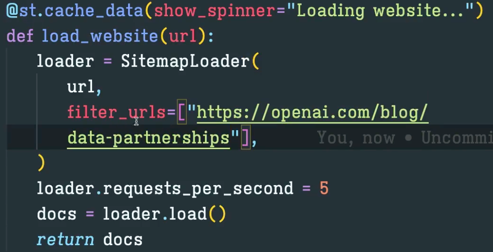
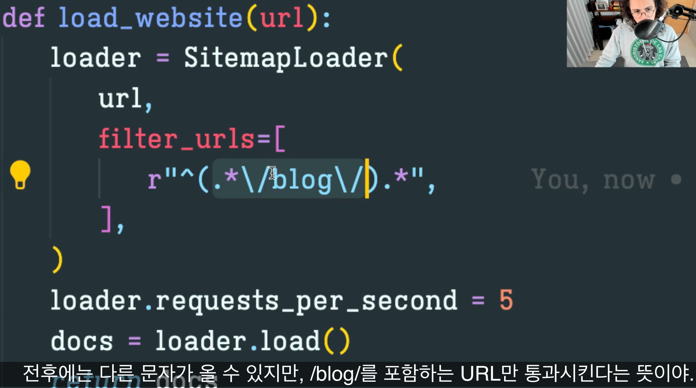
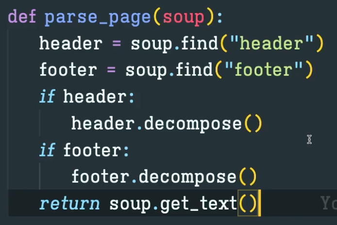
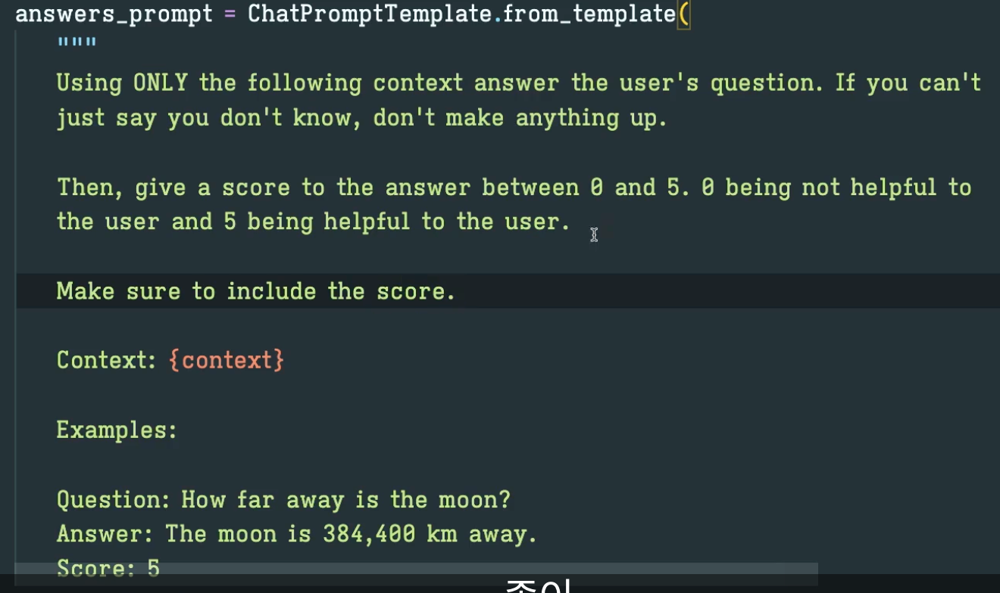
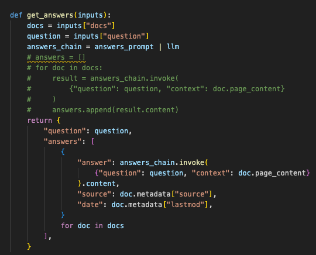
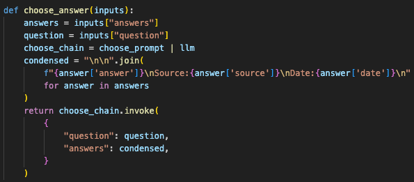
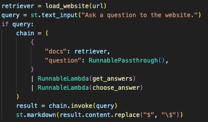

# 10 SITE GPT
## 10.0 Introduction
- chatbot을 만들 예정이며, OPEN AI를 크롤링해서 데이터를 가져오고자 함 
- 이번 섹션에서는 아래 두가지에 대해 알아볼 예정
    1. LangChain Integration을 통해 웹사이트로부터 데이터 얻기
    2. Websight로부터 받아온 HTML data코드 정리 

- Map Re-Rank라는 또다른 Document Chain을 구현해볼 예정 

## 10.1 AsyncChromiumLoader
- 두 가지 type의 Data loader를 배워볼 예정  
    - Playwright, Chromium : 동적인 웹사이트에 사용 
    - Sitemap loader : 정적인 text로 구성된 웹사이트에 사용

- 예시에서는 Playwright를 사용하여 HTML를 가져옴 (HTML은 HTML2TextTransformer()를 이용하여 변환함)
- SitemapLoader는 sitemap에 접속 후 그 안에 있는 모든 Url들을 천천히 조회함. 그 후 text를 추출

## 10.2 SitemapLoader
- URL은 입력했는지 XML Sitemap이 포함되어있는지 확인 예정 
- load_and_split() : 페이지를 분할할 때 사용 
- 페이지를 긁어올 때 너무 빠르게 긁어오면 막힘. 그러나 SitemapLoader는 default가 1초라 어느정도 커버 가능. 요청 속도를 조절하고 싶다면 loader.request_per_second를 통해 조절 (loader.request_per_second = 1)
- @st.cache_data를 추가하여 한번 호출한 Url은 다시 호출되지 않도록 함

## 10.3 Parsing Function
- 스크랩해온 url을 필터링하는 법을 살펴볼 예정 (Ex. page의 blog section만 포함해서 스크랩하는 등)
- SitemapLoader에 filter_urls 속성으로 추가하면 됨

- 정규식을 통해서 filtering가능

- beatifulsoup을 통해 원하는 특정 요소들을 손쉽게 제거 가능 (Ex.header/footer를 제거한 나머지 text 반환)

## 10.4 Map Re Rank Chain
- 질문을 하면 관련된 document들을 받아 답변을 생성하고 각 답변에 점수를 매김
- 최종적으로 가장 높은 점수를 획득한 답변과 그 점수를 함께 반환함 
- LLM이 원하는 결과를 줄 수 있도록 프롬프트를 잘 만들어야 함

- Answer 결과 저장

- Answer 선택 예

- 호출 예

## 10.5 Map Re Rank Chain part Two
- 개발한 코드를 리팩토링함 (list comprehension 사용) 
- Streamlit은 "$" 에 대해 버그가 있음 (Text를 수학식으로 변경함. "\$"로 replace하여 사용해야함)

## 10.6 Code Challenge 

