# MEETING GPT

## 11.0 Introduction
- 회의 영상이나 팟캐스트를 업로드하여 대화들을 추출한 후 대화중에 어떤일이 있어났는지 질문을 하는 챗봇을 구현 (Whisper API 사용할 예정 (오픈소스도 있고, 유료버전도 있음))

## 11.1 Audio Extraction
- FFmpeg : 동영상을 압축하거나 썸네일을 얻거나 오디오를 획득할 수 있음 (Ex. $ffmpeg -i input.mp4 output.avi 등)
- video to audio (Ex. $ffmpeg -i files/podcast.mp4 -vn files/audio.mp3)
    - -i : input file
    - -vn : 영상 무시 
- subprocess : 파이썬코드에서 command를 실행할 수 있게 해줌
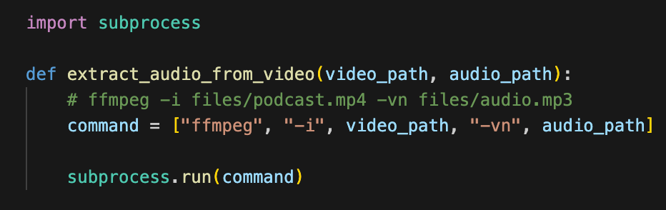

## 11.2 Cutting The Audio
- pydub : 파이썬으로 오디오를 조정할 수 있는 오픈소스
    - 파일을 분할하여 리스트 형태로 받거나, 원하는 시간대의 데이터도 추출 가능
    - 오디오 이펙트도 추가 가능(페이드인/아웃) 등등 
- AudioSegment.from_mp3(audio)를 이용하여 가져온 오디오 파일을 파이썬 배열의 슬라이싱 구문 "[:]"을 사용하여 원하는 대로 분할함
- 분할하는 이유는 chunk로 사용하려하기 때문 
    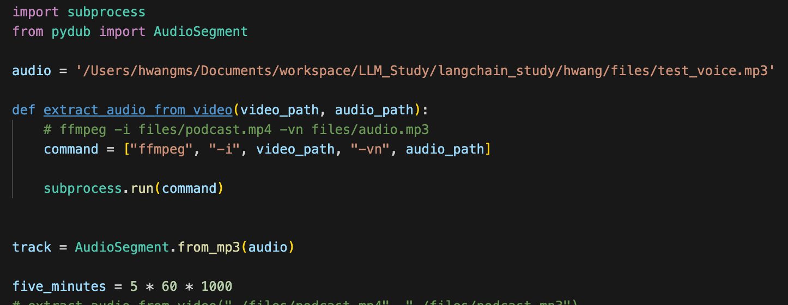
    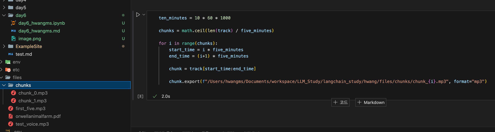

## 11.3 Whisper Transcript
- 잘라낸 chunk(오디오파일)를 OPENAI whisper를 사용하여 transcript를 얻고 텍스트 파일로 내보내는 작업 수행 
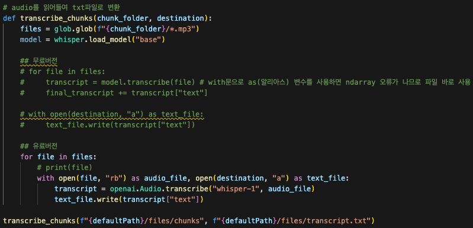

## 11.5 Upload UI
- MeetingGPT UI 꾸밈 
- streamlit의 기본 upload size는 200MB임. 늘리고 싶을 경우 /.streamlit/config.toml을 생성한 후 maxUploadSize를 지정해주면 됨.
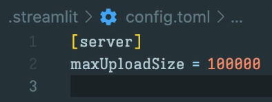
- loading 이미지를 넣고 싶을 경우 st.status()사용하자 
    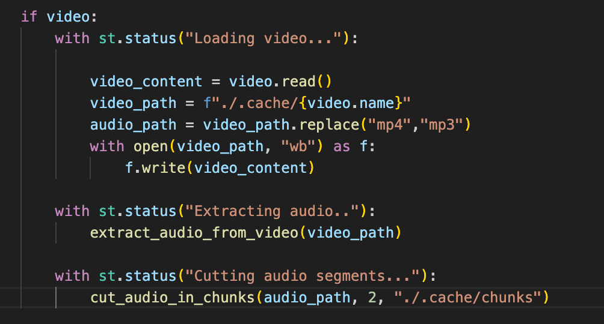
    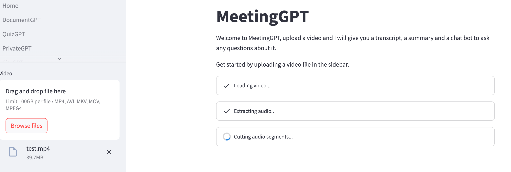

- glob은 파일을 불러올 때 순서를 보장하지 않음. transcript를 생성할때 순서를 보장하지 않는다면 

## 11.6 Refine Chain Plan
- st.status는 status.update를 이용하여 refactoring 할 수 있음 
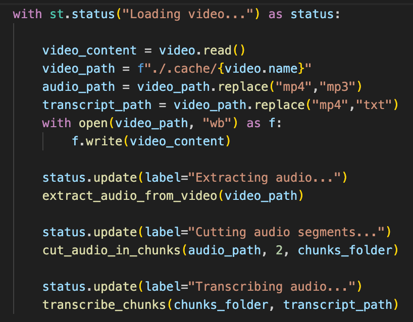

- Transcript는 STT결과를 모두 나타내고, 
- Summary 탭에는 chunk로 나눈 각각의 문서들을 요약한 후 하나로 합친 내용을 포함할 것임
    - 그러나, 각 문서들을 요약한 것을 단순하게 합치진 않고 다음 문서를 통해 얻은 데이터를 이용하여 이전 요약본을 업데이트하는 식임.
    - 이런 것을 랭체인 용어로 refined chain이라고 하는데 response는 input document들을 순회하면서 답변을 업데이트 해주는 방법
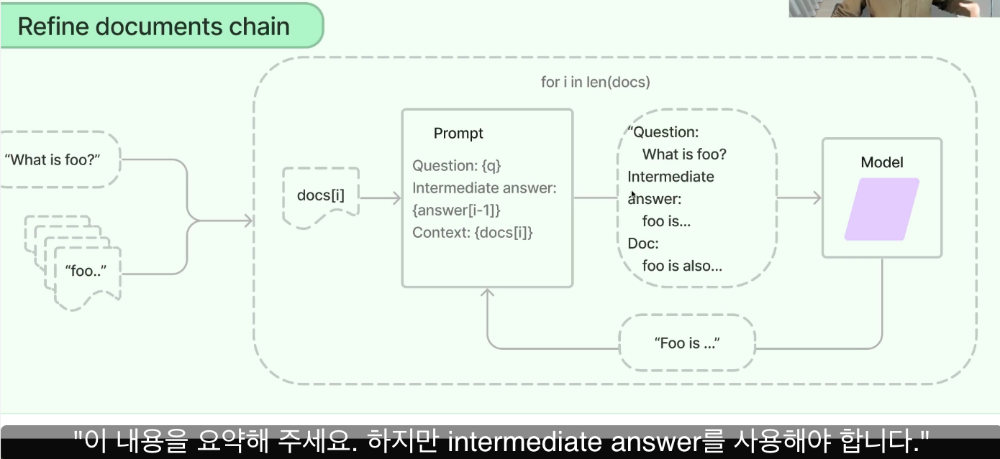

- 프롬프트에 업데이트하겠다고 남겨놔야 함 
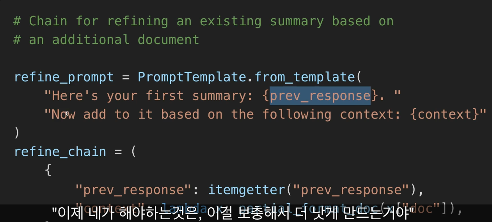

## 11.7 Refine Chain
- Chain 개발 (두개의 체인 구성. 첫번째는 요약, 두번째는 기존 요약에 추가 문서를 더해서 다시 요약 )
- 첫번째 document로 요약한 내용 
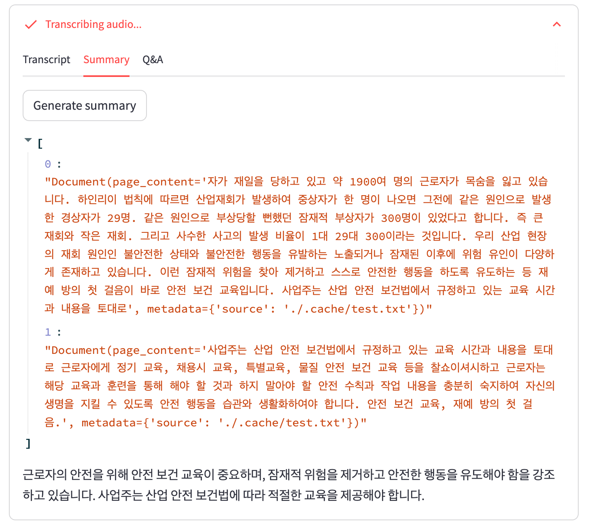
- 전체 내용 요약 
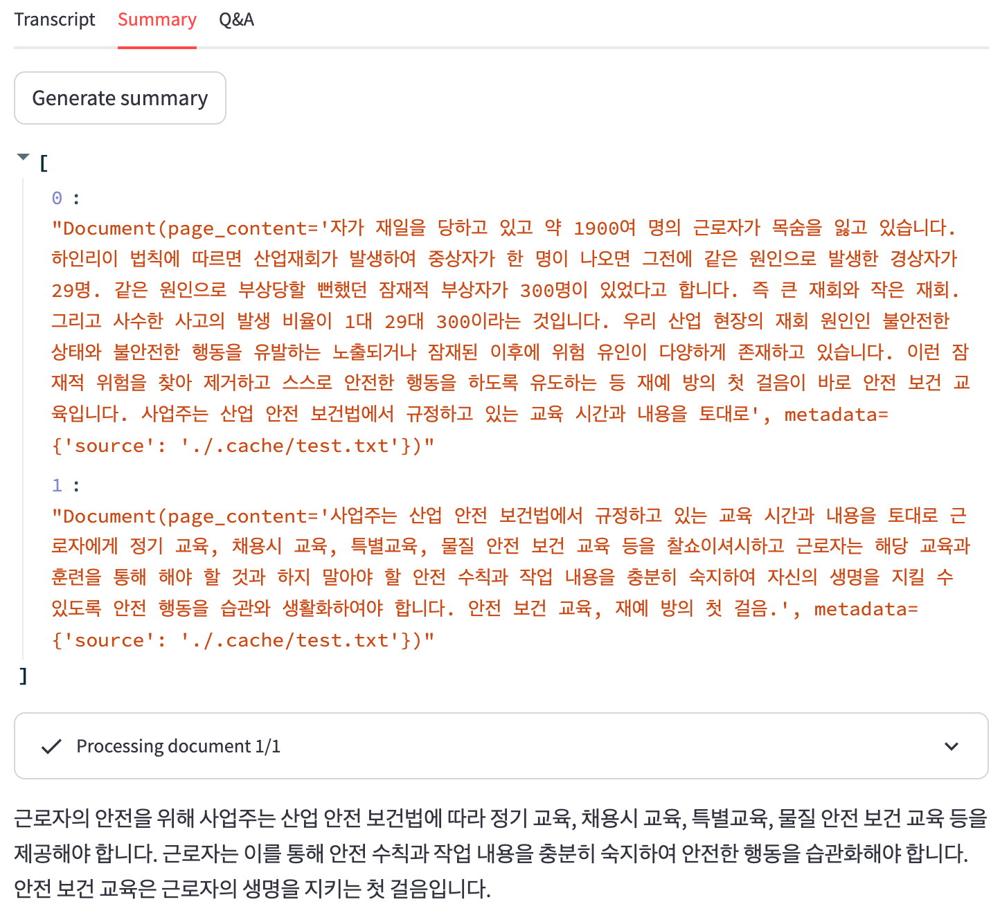

## 11.8 Q&A Tab
- 