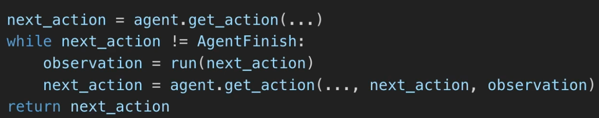
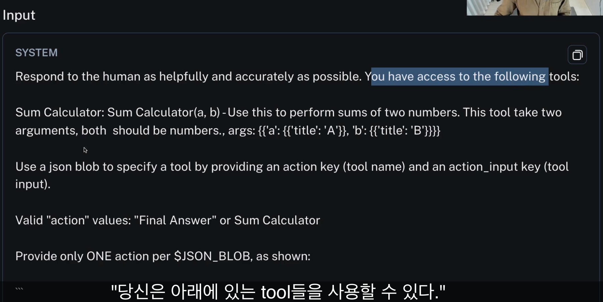
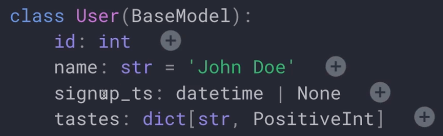

# InvestorGPT

## 12.0 Introduction
- Agent : GPT가 가져올 수 없는 정보(최신정보)들을 가져올 수 있도록 Tool들을 개발한 뒤 이를 Agent에 넣어 동작시키는 것을 구현할 예정 
- agent에게 정보를 주지도 않고, 결론을 만들어내라는 요청도 하지 않음. 정보도 주고 결론을 만들어달라는 것은 chain과 다를바가 없음 
- 그냥 원하는 것을 말하면 agent가 알아서 추론을 한 후 그 정보들을 모아서 우리에게 결과를 제공함
- SQL Toolkit을 사용할 예정이며, 이 것을 이용하여 DB에 있는 내용으로 채팅을 할 수 있게 해줌(agent는 알아서 DB가 어떻게 생겼는지 확인하여 SQL code를 만들고, 그것을 실행하여 사용자에게 결론을 제공함)

## 12.1 Your First Agent (09:38)
-  initialize_agent를 이용하여 에이전트를 초기화하며, AgentType을 이용하여 원하는 타입을 설정하면 됨 
- verbose옵션은 대답을 길게 해줌 

```python 
from langchain.tools import StructuredTool
from langchain.agents import initialize_agent, AgentType

agent = initialize_agent(
    llm=llm,
    verbose=True,
    agent=AgentType.STRUCTURED_CHAT_ZERO_SHOT_REACT_DESCRIPTION, 
    tools=[
        StructuredTool.from_function(
            func=plus,
            name="Sum Calculator",
            description = "Use this to perform sums of two numbers. This tool take two arguments, both should be numbers."
        ),
    ]
)
```

## 12.2 How Do Agents Work (12:28)
- 랭스미스를 통해 확인해보면 LLMChain을 많이 부른 것을 확인할 수 있음
- 이는, Tool 반복실행을 통해 LLM을 계속 부르기 때문임 
- Agent run-time에 대해 확인해보면 (pseudo code)
    1. agent에 input을 줄 때 runtime은 LLM으로부터 get_action을 받아옴 
    2. LLM은 어떤 액션을 할지 고름
    3. AgentFinish(LLM이 고른 액션이 agent로 하여금 끝내라는 신호)가 나오기 전까지 다음 액션들을 계속 수행함

- 프롬프트에서 확인해보면 랭체인에 프롬프트가 자세하게 설명되어 있음 
    - Thought, Action, Observation 순으로 진행하는 것을 볼 수 있음 

- 마지막 프롬프트를 확인해보면, Observation과 Thought가 끝난것을 확인할 수 있음.
- 참고로, LLM은 간혹 잘못 동작되어 response에서 우리가 원하는 결과값으로 나오지 않거나 이해를 잘못하여 끝나는 문장으로 결과가 나와 종료되는 경우가 있음. 이럴 경우 output parser가 동작할 때 파싱에 실패하여 agent가 고장나는 것임. 

## 12.3 Zero-shot ReAct Agent (09:47)
- 이전 강의에서 사용한 것은 "Strucured input ReAct"로 multi-input 툴이라 여러개 입력이 가능했었음
- 그러나 zero-shot은 multi-input이 안됨
- zero-shot은 가장 범용적인 목적의 에이전트로 function calling이 없는 모델을 사용한다면 zero-shot reAct는 그 해답임 
- multi-input을 해결하기 위해선 프롬프트에 ","로 구분한 데이터가 들어간다고 하고, 해당 함수에서 split으로 구분하여 처리하면 됨.
- 결과값 파싱에 실패해서 오류가 나면 "handle_parsing_erros=True" 아래속성을 추가하면 됨. (자동으로 오류를 개선함)

## 12.4 OpenAI Functions Agent (10:51)
- OpenAI Function Agent(AgentType.OPENAI_FUNCTIONS)을 사용하려면 다른 방법으로 Tool을 설정해야 함 
- Pydantic : 데이터 유효성 라이브러리중 하나. 데이터가 어떤 형태인지 알려줌 (Ex. 어떤 클래스를 정의했고, 해당 클래스 형태의 데이터가 들어왔을 때 정상적으로 들어왔는지 확인)

- 이 agen의 프롬프트를 살펴보면 생각보다 간단함. ("You are a helpful AI assistant")
- 결론 : BaseTool을 이용하여 Tool을 만들고, 툴의 
이름과, 설명, argument형태를 결정함


## 12.5 Search Tool (04:15)
- 회사정보를 웹에서 찾는 툴을 이용함 
- DuckDuckGo는 검색엔진중 하나이며 쉽게 사용 가능 

## 12.6 Stock Information Tools (14:27)
- 여러 tool에 대해 설명
    1. Alpha Vantage : 가입 후 API키를 이용하여 여러 API 사용가능 (ex. 주식 실적, 뉴스정보, 손익계산서, 대차대조표 등 여러 회사 정보들을 쉽게 가져올 수 있음)
    2. Yahoo Finance도 있음 


## 12.7 Agent Prompt (10:32)
- Streamlit UI로 옮기는 작업 수행

## 12.8 SQLDatabaseToolkit (10:18)
- langchain에는 다양한 tool들을 제공하고 있기 때문에 개발에 필요한 Tool이 있으면 agent에 넣어 마음껏 써도 됨
- 간단하게, DB만 연동하면 끝이고 쿼리는 프롬프트를 통해 알아서 생성하여 결과를 얻어냄
- 예제에서는 SQL toolkit을 사용하였기 때문에 툴킷 내에 존재하는 툴들을 통해 알아서 답변을 만들어 냄 
- toolkit에 대한 사용법이 궁금할 경우 아래와 같이 사용하면 됨

```python
toolkit = SQLDatabaseToolkit(db=db, llm=llm)
toolkit.get_tools()
```

* model에 따라 되는게 있고 안되는게 있는 것 같음. (gpt-4o-mini는 안됨)

## 12.9 Conclusions (02:39)
- streamlit 배포에 대해 알려줌 
- 회원가입 후 새 앱 만들기 한 후에 가이드에 따라 배포
