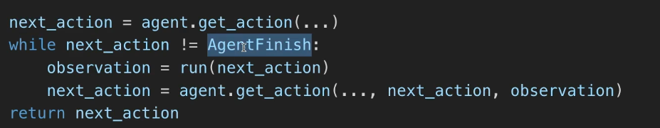
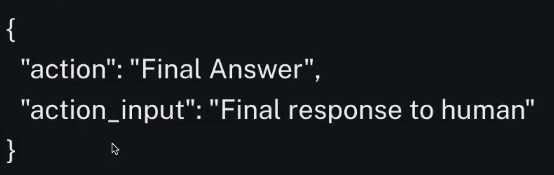

# 12 InvestorGPT

## 12.0 Introduction
### agent에 대해서 알아보자. 우리만의 custom agent 만들고 custom tools를 사용 > investor GPT agent 제작
### sql database와 Chat하게 해주는 sqldatabase toolkit에 대해서도 알아보자


## 12.1 Your First Agent
### 첫번째 custom agent tool을 제작

prompt = "Cost of $355.39 + $924.87 + $721.2 + $1940.29 + $573.63 + $65.72 + $35.00 + $552.00 + $76.16 + $29.12"
llm.invoke(prompt)

llm이 정답을 출력해주진 않음 > 계산기가 더 정확함 > llm은 다음 텍스트 통계적 추론해주는 모델일뿐 계산기가 아님.

>> 우리가 agent를 만들고 agent를 위한 tool을 작성해주자.  > structuredTool을 사용하여 여러개의 input을 가질 수 있다.

```python
from langchain.tools import StructuredTool
from langchain.agents import initialize_agent, AgentType

def plus(a, b):
    return a + b


agent = initialize_agent(
    llm=llm,
    verbose=True, # 말이 많음 > 우리에게 agent가 하는 작업의 모든 과정 및 추론을 보여줌
    agent=AgentType.STRUCTURED_CHAT_ZERO_SHOT_REACT_DESCRIPTION, # STRUCTURED_CHAT(chat에 최적화)_ZERO_SHOT_REACT(react논문에 기반한 agent)_DESCRIPTION
    tools=[
        StructuredTool.from_function(
            func=plus,
            name="Sum Calculator",
            description="Use this to perform sums of two numbers. This tool take two arguments, both  should be numbers.",
        ),
    ],
)

```


## 12.2 How Do Agents Work
### agent가 어떻게 작동하는지 설명

>> 사실상 어려운 일을 많이하는 것은 gpt3, gpt4보다는 langchain이다. > langchain 문서(https://python.langchain.com/v0.1/docs/modules/agents/concepts/))에 agent loop 가 어떻게 동작하는지 보여주는 pseudo code 부분이 있다.

LLM이 끝남을 의미하는 AgentFinish로 응답하지 않는다면 컴퓨터를 실행시킬 그 LLM이 고른 함수를 실행한다. > 이후 이전 next_action과 observation을 기반으로 다음 액션을 고르라고 할 것이다. 
> 위 과정울 LLM이 고른 action이 agent로 하여금 끝내라는 신호를 줄때까지 반복


>> langchain은 LLM의 응답을 가져와서 그 응답을 langchain이 파싱하고 응답을 파싱한 후에 langchain을 사용할 툴을 선택한다. langchain은 우리 컴퓨터에서 코드를 실행할 것이고 
langchain은 그 결과값을 가지고 다시 LLM에 돌려준다. 이 반복은 아래 응답이 올때까지 계속해서 반복한다.

위 응답은 langchain이 output parser을 활용해서 파싱한 결과이다.(Final Answer이 오면 멈춰야 할 시점을 알게된다.)
>> 가끔 LLM이 잘 동작하는 방법으로 응답하는 경우도 있어서 out parser에서 동작하지 않는 경우가 있음 > quiz에서 봤던 것처럼 그럴땐 우리가 LLM에게 가능한 이 형식으로 답변하라고 강요할 수 있다.
>> langchain에서 항상 동작하는 것처럼 보이는 엄청난 프롬프트를 만들었지만 아주 가끔 LLM은 json이 아닌 text로 응답할 때가 있는데 그럼 output parser가 LLM의 잘못된 답을 파싱할 수 없기 때문에
agent가 고장나는것 > OpenAI의 함수호출(Function call)기능을 활용가능함


## 12.3 Zero-shot ReAct Agent
### agent에 다양한 유형이 있지만 우리는 Zero-shot ReAct을 살펴본다., 12.4에서 배울 agent와는 달리 많은 모델들과 같이 사용가능
https://python.langchain.com/v0.1/docs/modules/agents/agent_types/openai_functions_agent/

Zeroshot react : 가장 범용적인 목적의 agent
https://python.langchain.com/v0.1/docs/modules/agents/agent_types/react/
> 함수호출을 지원하는 OpenAI의 gpt3/4를 사용하지 않는다면 Zeroshot react가 함수 호출을 지원하지 않는 다른 모델들과 같이 사용하게 될 것이다.

Zeroshot ReAct와 Structured Input ReAct의 다른점은 Structured Input이 여러 입력을 가질 수 있지만 Zeroshot은 아니라는 것이다. 
> 아래와 같이 description에 적절한 문구를 추가하여 처리가능
description="Use this to perform sums of two numbers. Use this tool by sending a pair of number separated by a comma.\nExample:1,2"
> LLM이 우리가 원하는 출력 형식으로 응답하지 않아 output parser에 파싱에러가 발생하면 handle_parsing_errors=True를 통해 파싱에러를 고치도록 할 수 있다.(langchain이 자동으로 해결)

react논문(arxiv.org/pdf/2210.03629.pdf) : agent를 어떻게 활용하고 agent가 잘 동작하기 위해 어떤 지시를 줘야하는지 써있다.


## 12.4 OpenAI Functions Agent 
### GPT3/4 같은 OpanAI에서만 동작가능한 agent

>> Open AI 함수를 사용하기 위해선 다른 방법으로 Tool을 설정해야함 > Pydantic에 대해 알아보자 : python의 데이터 유효성 라이브러리중 하나(docs.pydantic.dev/latest)
> 우리의 데이터가 어떤 형태여야 하는지 알려준다. : OPENAI를 사용할 때 quizGPT에서 다루었던 것보다 훨씬 더 편리한 방법

